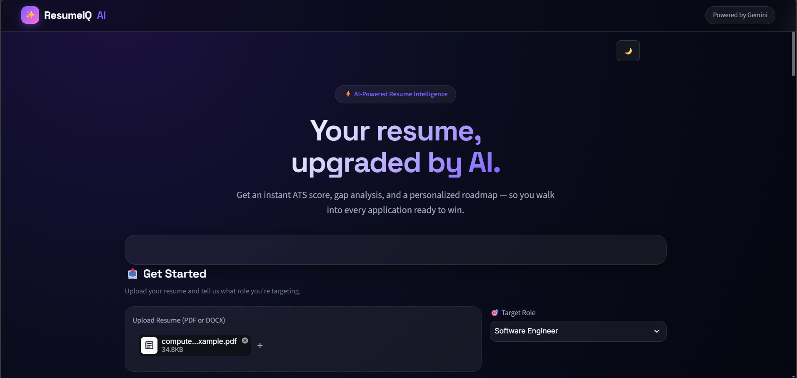
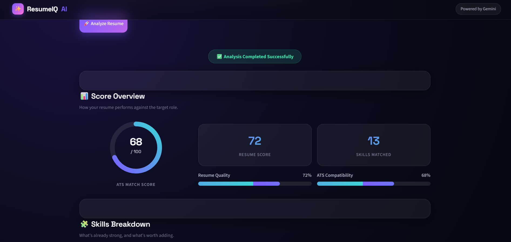
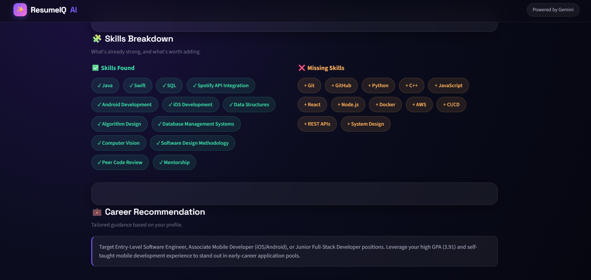
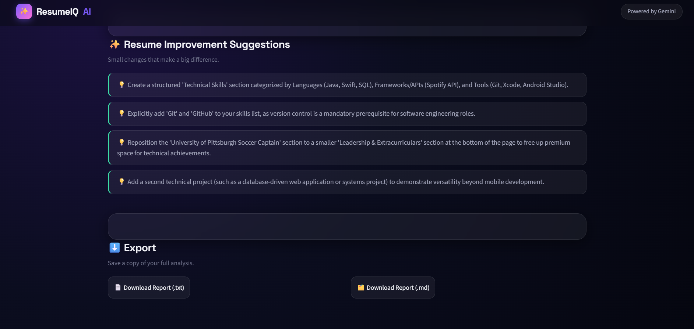

# ResumeIQ-AI
ResumeIQ-AI is an AI-powered web application that analyzes resumes using Google's Gemini AI. It calculates ATS compatibility, identifies missing skills, provides personalized career recommendations, and suggests improvements to help users build stronger resumes.
## 📸 Screenshots

## 🏠 Home Page

This is the landing page where users can upload their resume and choose their target job role.

## 📊 Score Overview

After analyzing the resume, ResumeIQ-AI displays the ATS score, resume quality, and overall evaluation.

## 🧩 Skills Breakdown

The application identifies detected skills and highlights missing skills required for the selected role.

## 💡 Improvement Suggestions

ResumeIQ-AI provides personalized recommendations to improve the resume and increase ATS compatibility.

